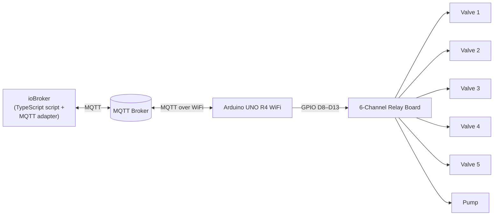

# Arduino Remote Switch – MQTT Irrigation Controller

An MQTT-controlled relay switch built on an **Arduino UNO R4 WiFi**, remotely orchestrated by an **ioBroker** instance. The Arduino drives a 8-channel relay board (5 irrigation valves + 1 pump => 6 channels are used only) over WiFi/MQTT, while an ioBroker TypeScript script implements the scheduling, retry, and pause logic on top of it.

While the included script is tailored to a garden irrigation setup, the Arduino sketch itself is generic: it exposes 6 MQTT-controllable relay outputs and can be reused for any project that needs to switch things on/off remotely (lights, pumps, garage doors, etc.).

## Architecture



1. The ioBroker script sets a *should* state (e.g. "open valve 2").
2. The ioBroker MQTT adapter publishes this as an MQTT message to the broker.
3. The Arduino, subscribed to that topic over WiFi, switches the corresponding relay.
4. The Arduino continuously reads back the real GPIO state and publishes it as an *is* topic.
5. The ioBroker script polls the *is* state until it matches what was requested, retrying the command if the Arduino doesn't confirm within a timeout.

This should/is + retry pattern makes the system resilient to lost WiFi/MQTT packets or a temporarily unreachable Arduino.

## Repository Structure

```
arduino-remote-switch/
├── README.md
├── arduino-fw/
    └── arduino-remote-switch.ino  # Firmware for the Arduino UNO R4 WiFi
└── iobroker-js/
    └── irrigation-control.js      # TypeScript script for the ioBroker JavaScript/TypeScript adapter
```

## Hardware

- **Arduino UNO R4 WiFi** (the sketch relies on `WiFiS3`, the onboard LED matrix, and the Renesas watchdog timer, which are specific to this board)
- A **6-channel relay board**, active-LOW (a `LOW` signal energizes the relay)
- 5 irrigation solenoid valves + 1 pump (or any other loads you want to switch)
- An MQTT broker reachable on your local network (e.g. Mosquitto)
- An ioBroker instance with the **MQTT adapter** and **JavaScript/TypeScript adapter** installed

If you want to copy it 1:1, don't hesitate to ask me for amazon links etc. for the exact hardware.

### Pin mapping

| Arduino Pin | Relay Channel | Used for (example setup) |
|---|---|---|
| D8  | 1 | Valve 1 – East strip |
| D9  | 2 | Valve 2 – Garden, east side |
| D10 | 3 | Valve 3 – Garden, north |
| D11 | 4 | Valve 4 – Garden, west |
| D12 | 5 | Valve 5 – Garden, west side (rear) |
| D13 | 6 | Pump |

> ⚠️ **Safety note:** if your relay board switches mains voltage (e.g. for the pump), make sure the wiring, fusing, and enclosure comply with local electrical safety regulations. If in doubt, consult a qualified electrician.

## Arduino Firmware (`arduino-remote-switch.ino`)

### Required libraries

Install via the Arduino Library Manager:

- `WiFiS3` (bundled with the UNO R4 board package)
- `ArduinoMqttClient`
- `ArduinoGraphics`
- `Arduino_LED_Matrix`
- `WDT` (bundled with the UNO R4 board package)

### Configuration

The sketch expects a `wifi_secrets.h` file next to the `.ino` file, containing your WiFi credentials. It is **not** included in this repository — create it yourself and keep it out of version control (add it to `.gitignore`):

```cpp
// wifi_secrets.h
char ssid[] = "your-wifi-ssid";
char pass[] = "your-wifi-password";
```

Set your MQTT broker's address at the top of the sketch:

```cpp
const char broker[] = "192.168.178.78"; // <- change to your broker's IP
int        port     = 1883;
```

### Behavior

- Connects to WiFi, then to the MQTT broker; both connection attempts are retried automatically and reflected on the onboard LED matrix (`?WiFi` while joining WiFi, `!MQTT` while connecting to the broker, a "happy face" once everything is up).
- If the MQTT connection can't be re-established after 30 attempts, all relays are switched off and the loop deliberately blocks, causing the watchdog (2 s timeout) to force a hardware reset.
- Every 2 seconds it publishes the current (actual) state of all 6 relays; every 30 seconds it publishes the WiFi signal strength (RSSI) to the MQTT server (iobroker).
- Incoming MQTT messages are matched by the last character of the topic (`.../should/2` → relay 2) and set the relay to `HIGH`/`LOW` based on the payload (`"1"`/`"0"`).

### MQTT topics

| Topic | Direction (Arduino) | Payload | Meaning |
|---|---|---|---|
| `arduino/irrigation/should/1` … `should/5` | subscribe | `"0"` / `"1"` | Requested state of valve 1–5 (`0` = open/on, `1` = closed/off) |
| `arduino/irrigation/should/6` | subscribe | `"0"` / `"1"` | Requested state of the pump |
| `arduino/irrigation/is/1` … `is/6` | publish (every 2 s) | `"0"` / `"1"` | Actual, read-back state of relay 1–6 |
| `arduino/irrigation/info/rssi` | publish (every 30 s) | integer | Current WiFi signal strength in dBm |

The relay board used here is active-LOW, so `"0"` energizes the relay (valve open / pump running) and `"1"` de-energizes it (valve closed / pump off).

## ioBroker Script (`iobroker-js/irrigation-control.js`)

Written for ioBroker's JavaScript/TypeScript adapter (Script Engine). It assumes the **MQTT adapter instance `mqtt.0`** is subscribed to the `arduino/#` topic tree, which auto-creates matching states such as `mqtt.0.arduino.irrigation.should.1` and `mqtt.0.arduino.irrigation.is.1` from the topics above.

### What it does

- Defines the 5 irrigation zones and the pump, mapped to the `should`/`is` states.
- On script start, immediately stops all irrigation (safety measure in case the script restarts mid-cycle).
- Runs a scheduled irrigation sequence every day at midnight, watering each configured zone in pulsed cycles (on for a set duration, then a recovery pause, repeated N times) rather than one continuous run — this reduces runoff on compacted soil and in my special case it was needed because of the small amount of water I have in my well, but the quite fast time the water flows back into the well, once you stop irrigation (~ 10 min).
- Respects three pause switches under `0_userdata.0.IrrigationControl`:
  - `Pause1Day` – skips today's run, auto-resets at 8:00 in the morning every day.
  - `PausePermanently` – disables scheduled irrigation until turned off manually
  - `PauseSeeding` – reserved for custom seeding-phase logic, which is not implemented right now.
- Uses a set/verify/retry helper (`SetCheckWaitValue`) that sets a `should` state, then polls the corresponding `is` state once per second; if the Arduino hasn't confirmed the change after 100 s it resends the command, and gives up after 60 minutes.
- You can use all of the signals ('is', 'should' and the different pauses) in a small frontend designed in iobroker. Mine is based on iQontrol.

### Setup

1. Install and configure the **MQTT** adapter, pointed at the same broker as the Arduino, subscribed to `arduino/#`.
2. Install the **JavaScript** adapter and enable **TypeScript** for the script (or adjust the syntax if you prefer plain JavaScript).
3. Under `0_userdata.0`, create a folder `IrrigationControl` with boolean/number states `Pause1Day`, `PausePermanently`, and `PauseSeeding`.
4. Copy `iobroker-js/irrigation-control.js` into a new script and adjust the zone names, schedule, durations, and cycle counts to match your own garden layout.

## Customization

- The Arduino sketch is intentionally generic — the 6 relay channels don't have to be valves/pump; rename the MQTT topics and adjust the pin comments for any other switching use case.
- Zone count, names, watering durations, and the daily schedule are all defined in `irrigation-control.js` and can be freely adapted.

## License

Please see `LICENSE` file before using and publishing